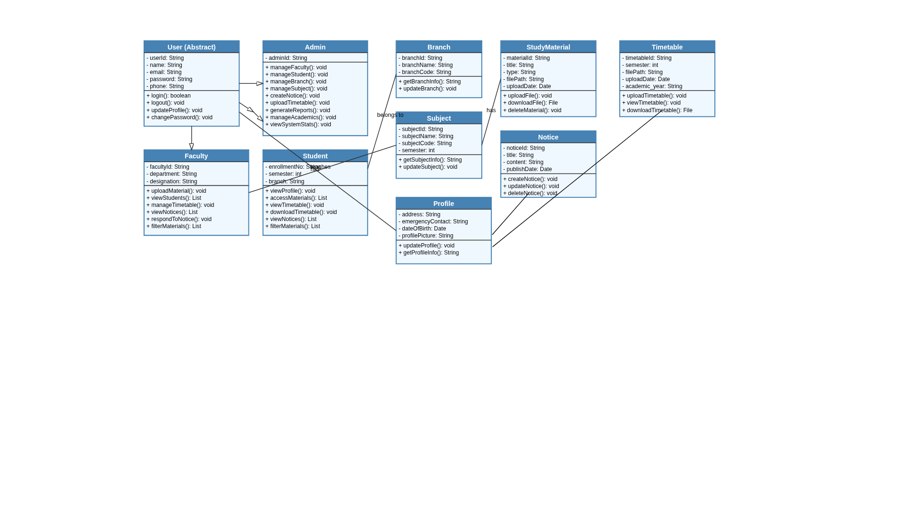
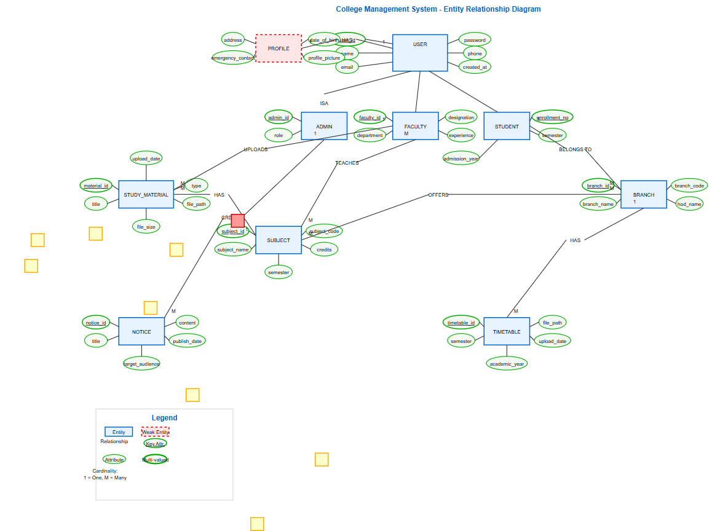

# College Management System

## Features

### Admin Features

- Manage faculty accounts with detiled profiles and emergency contacts
- Manage student accounts with enrollment numbers and academic details
- Manage academic branches
- Handle subject/course management by semester and branch
- Generate and manage notices for students and faculty
- Upload and manage timetables by branch and semester
- Profile management and password updates

### Faculty Features

- View and manage personal profile with emergency contacts
- Upload and manage study materials (notes, assignments, syllabus)
- Filter and organize materials by subject, semester, and type
- Upload and manage timetables for their branches
- Search and view student information by enrollment, name, or semester
- View and respond to notices
- Update profile and credentials
- Password management and reset functionality

### Student Features

- View personal profile and academic details
- Access study materials filtered by subject and type
- View class timetables with download option
- Access notices and announcements
- Update profile information
- Password management and reset functionality

## Tech Stack

- Frontend: React.js
- Backend: Node.js, Express.js
- Database: MongoDB
- Authentication: JWT


1. Clone the repository:

```bash
git clone <repository-url>
cd College-Management-System
```

2. Install dependencies:

```bash
# Install backend dependencies
cd backend
npm install

# Install frontend dependencies
cd ../frontend
npm install
```

3. Start the development servers:

```bash
# Start backend server (from backend directory)
npm run dev

# Start frontend server (from frontend directory)
npm start
```

## Initial Setup

1. Create an admin , student and faculty  account using the seeder:

```bash
cd backend
npm run seed
```

This will create a default  account with the following credentials:

- Employee ID: 123456
- Password: admin123
- Email: admin@gmail.com
-----------------------------------------------------
- Enrollment_no. : 123456
- Password: student123
- Email: student@gmail.com
-----------------------------------------------------
-  Employee ID: 123456
- Password: faculty123
- Email: faculty@gmail.com

## Project Structure

```
college-management-system/
├── Assets
├── backend/
│   ├── controllers/
│   │   ├── models/
│   │   ├── routes/
│   │   ├── middlewares/
│   │   ├── utils/
│   │   └── media/
│   └── README.md
├── frontend/
│   ├── src/
│   │   ├── components/
│   │   ├── pages/
│   │   ├── context/
│   │   └── utils/
│   └── public/
├── .gitignore
├── package.json
├── package lock.json
├── Documentation
└── README.md
```
## diagram






